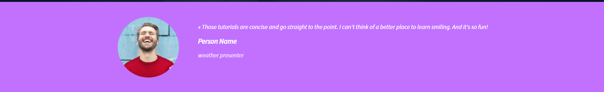
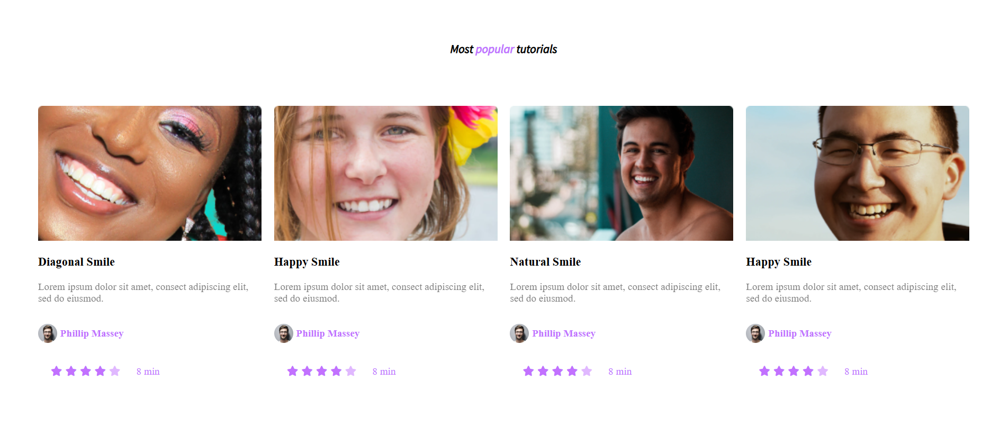
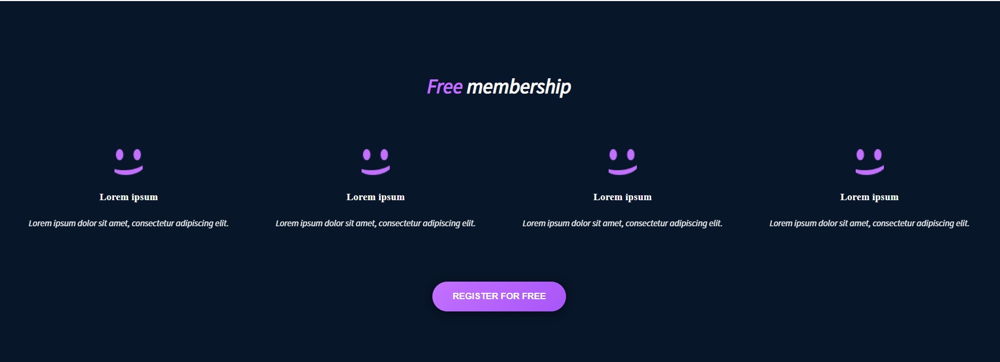
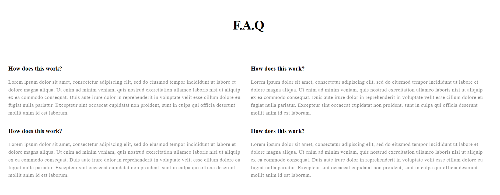

# Smiling School Landing Page 🎉

A responsive, pixel-perfect landing page built with **HTML5, CSS3, and Font Awesome**, inspired by a [Figma design](https://www.figma.com/design/dyYL6Ku4WG7vsdpwvlcJZC/Homepage?node-id=3558-0&t=z3KpPMO84Zn8oeDL-0).

This project demonstrates mastery of **responsive layouts**, **flexbox & grid**, and **semantic HTML**, while translating a design file into clean, production-ready code.

---

## 🚀 Features

- 🎨 **Pixel-accurate UI** matching the Figma design  
- 📱 **Responsive design** — optimized for desktop, tablet, and mobile breakpoints  
- 🖼 **Hero Section** with background image, tagline, and call-to-action button  
- 👩‍🏫 **“Learn from the Pros” Section** with circular profile cards  
- 💜 **Testimonial Section** with image + text overlay  
- 🎥 **Popular Tutorials Section** with video cards, ratings, and authors  
- ⭐ **Free Membership Section** with benefits and sign-up CTA  
- ❓ **FAQ Section** with grid layout for Q&A items  
- 🔗 **Footer** with brand logo and social media links  

---

## 🛠️ Tech Stack

- **HTML5** — semantic structure  
- **CSS3** — flexbox, grid, media queries, custom fonts  
- **Font Awesome** — social media and star rating icons  
- **Google Fonts / Local Fonts** — Source Sans Pro  

---

## 📂 Project Structure

├── index.html
├── styles.css
├── /images # logo, backgrounds, icons, profile pictures
├── /fonts # Source Sans Pro font files

## Screenshots

